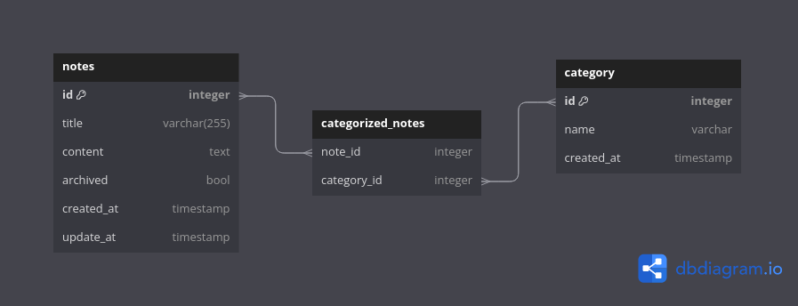

# Logger

Here I will document my decision taking process and my journey in general with this project.

## Why Java for the backend

Since the technological requirements for this app are:

1. Separate the backend and the fronted in order to create an SPA
2. Expose a REST API from the backend
3. Use a layered architecture on the backend

I decided to use Java over other alternatives like Node.js, Golang or even Python. My criteria to choose Java over the others is based on three main reasons:

* Familiarity: I was already familiar with the language and the paradigm behind it.
* Structure: Being an Object-Oriented language give me a structure and rules that match with the problem design
* Company culture: Since part of my process required certain knowledge about Java, and also the example of the layered architecture was also on this language; I feel like using Java is what match with the usual way of approaching the problems here.

## Database

For the database we could consider working with SQL or NoSQL databases since with both I was able to persist the data.
In this opportunity I choose working with RDBMS because the structure of the data matches the idea of relational databases and the amount of data that is handled for a single user is not something to worry about. So I think suits perfect for the implementation.

The concrete tools to get along with this implementation will be Postgresql and Hibernate as the ORM tool

